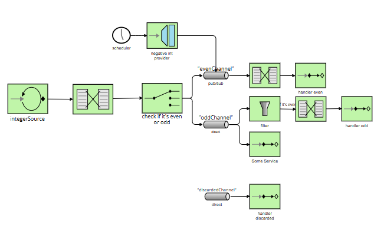

# Lab 5 Integration and SOA - Project Report

## 1. EIP Diagram (Before)



The starter code implements an application that generates a sequence of positive integers and classifies them into 
`evenChannel` and `oddChannel`. It also has a negative integers provider that injects the numbers directly into `evenChannel`.

The `evenFlow` reads from `evenChannel`, a publish/subscribe channel, and processes the numbers from there. On the other 
hand, when a message goes to `oddChannel`, the flow splits into two different paths. Although both paths should receive the
same information, 50% of the messages go to each path:
- 50% of the information goes through a filter where only even numbers are accepted (due to an incorrect filter that 
we'll comment below).
- 50% of the information goes to `SomeService` service.

In the starter code there was another channel called `discardedChannel` that is never used.

 

---

## 2. What Was Wrong
I have found some bugs on the starter code, that I solved in order to match the final code with the diagram provided on 
the Lab 5 Guide provided by the teacher.

### Bug 1: Incorrect channel declaration
- **What was the problem?** The main problem in here was that there were two subscribers attached to `oddChannel`, which was
declared as a direct channel instead of as a publish-subscribe channel. The result of this mistake was that only one of
the subscribers, not both of them, received each message.
- **Why did it happen?** As mentioned above, there was a mistake when declaring `oddChannel` as a direct channel.
- **How did you fix it?** The declaration of `oddChannel` was changed from `directChannel` to `PublishSubscribeChannel`.

```kotlin
/**
 * Defines a publish-subscribe channel for odd numbers.
 * Multiple subscribers can receive messages from this channel.
 */
@Bean
fun oddChannel(): PublishSubscribeChannelSpec<*> = MessageChannels.publishSubscribe()
```

### Bug 2: There wasn't a numberChannel for proper message distribution
- **What was the problem?** The integer providers routed the messages right away, without an intermediate channel that 
sorted the numbers into the right channels.
- **Why did it happen?** As mentioned, the mistake was not having an intermediate channel where to send messages to.
- **How did you fix it?** A new channel (`numberChannel`) and a new flow (`numberFlow`) were created. The following step 
was to modify `myFlow` so it consumes the messages from `numberChannel`. Instead of sorting the messages into odd or even 
channels in `myFlow`, that logic was brought to `numberFlow`. 

```kotlin
/**
 * Main integration flow that polls the integer source and routes messages.
 * Polls every 100ms and routes based on even/odd logic.
 */
@Bean
fun myFlow(integerSource: AtomicInteger): IntegrationFlow =
    integrationFlow(
        source = { integerSource.getAndIncrement() },
        options = { poller(Pollers.fixedRate(100)) },
    ) {
        transform { num: Int ->
            logger.info("📥 Source generated number: {}", num)
            num
        }
        route { p: Int ->
            val channel = "numberChannel"
            logger.info("🔀 Router: {} → {}", p, channel)
            channel
        }
    }

@Bean
fun numberFlow(): IntegrationFlow =
    integrationFlow("numberChannel") {
        route { p: Int ->
            val channel = if (p % 2 == 0) "evenChannel" else "oddChannel"
            logger.info("🔀 Router: {} → {}", p, channel)
            channel
        }
    }
```

### Bug 3: Incorrect negative numbers distribution
- **What was the problem?** The negative int provider sent all the numbers in the evenChannel, even when the number 
included was odd.
- **Why did it happen?** The `requestChannel` was `evenChannel`, instead of a channel that sorted out the numbers in "even" or "odd".
- **How did you fix it?** Changed the requestChannel to `numberChannel`, where every message is forwarded to the right 
channel (even or odd).

```kotlin
/**
 * Messaging Gateway for sending numbers into the integration flow.
 * This provides a simple interface to inject messages into the system.
 * Note: Check which channel this gateway sends messages to.
 */
@MessagingGateway
interface SendNumber {
    @Gateway(requestChannel = "numberChannel")
    fun sendNumber(number: Int)
}
```

### Bug 4: Wrong filter logic in oddFlow
- **What was the problem?** When entering `oddChannel` there was a filter checking `p % 2 == 0`, meaning it only 
accepted even numbers and rejected the odd ones (exactly the opposite of what was meant to be). 
- **Why did it happen?** Because the logic of the filter condition was wrong, and it should be `p % 2 != 0`.
- **How did you fix it?** Removed the filter logic from `oddFlow` because the flow created before (`numberFlow`) already
put every number in the correct channel. Another solution would have been to change the filter condition to `p % 2 != 0`. 

```kotlin
/**
 * Integration flow for processing odd numbers.
 * Applies a filter before transformation and logging.
 * Note: Examine the filter condition carefully.
 */
@Bean
fun oddFlow(): IntegrationFlow =
    integrationFlow("oddChannel") {
        transform { obj: Int ->
            logger.info("  ⚙️  Odd Transformer: {} → 'Number {}'", obj, obj)
            "Number $obj"
        }
        handle { p ->
            logger.info("  ✅ Odd Handler: Processed [{}]", p.payload)
        }
    }
```

### Bug 5: Unused discardChannel
- **What was the problem?** It's not exactly a problem, but in the original code there was an unused `discardChannel` and 
`discardFlow`. 
- **How did you fix it?** I removed the "discard logic", as it didn't appear on the goal diagram, and it was not used at all. 

---

## 3. What You Learned
- **Enterprise Integration Patterns (EIP).** During this lab, I have gained a deeper understanding of EIP (Enterprise Integration Patterns), including
message channels (direct and publish/subscribe), routers, filters, and transformers.
- **Spring Integration.** I also learned how Spring Integration implements these patterns through flows. Each flow behaves like a pipeline 
where messages are transformed, routed, or handled.
- **Challenges and Solutions.** At first, the most challenging aspect of the laboratory was understanding how to transform the starter code into 
a diagram, but once the teacher explained it in class, it was simpler than I imagined. Another challenge I faced 
was identifying and tracing the message paths in order to be able to change the code according to the final diagram.

---

## 4. AI Disclosure
No AI tools were used while developing this laboratory.
