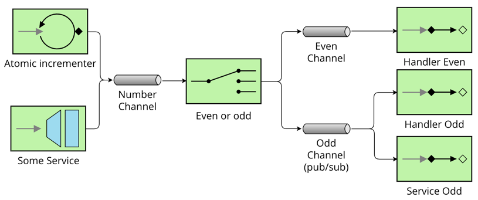

Welcome to the fifth lab assignment of the 2025–2026 course! This guide will help you complete the assignment efficiently. Although this guide is command-line oriented, you are welcome to use IDEs like **VS Code**, **IntelliJ IDEA**, or **Eclipse**—all of which fully support the tools we'll be using.

Ensure you have at least **Java 21** installed on your system before getting started.

**Estimated time**: 2 hours.

## Learning Objectives

By completing this assignment, you will:

1. **Understand Enterprise Integration Patterns (EIP)**: Learn the standard patterns for designing message-driven architectures
2. **Apply Spring Integration DSL**: Use Kotlin DSL to implement integration flows declaratively
3. **Analyze and Debug Integration Flows**: Read existing code to understand message routing and transformations
4. **Document with EIP Diagrams**: Create visual representations of integration architectures
5. **Fix Integration Issues**: Identify and correct problems in message-driven systems

## System Requirements

For this assignment, we'll be using the following technologies:

1. **Java Version**: The project targets **Java 21** (toolchain)
2. **Programming Language**: Kotlin 2.2.10
3. **Framework**: Spring Boot 3.5.3 with Spring Integration
4. **Build System**: Gradle 8.5
5. **Code Quality**: Ktlint Gradle plugin for code formatting

## Getting Started

### Clone the Repository

1. Clone your Lab 5 repository and change into the directory:

   ```bash
   git clone https://github.com/UNIZAR-30246-WebEngineering/lab5-soa.git
   cd lab5-soa
   ```

2. Build and run the application:

   ```bash
   ./gradlew clean build
   ./gradlew bootRun
   ```

The application will start and begin processing messages. Observe the console output to see the integration flow in action.

## Enterprise Integration Patterns Background

**[Enterprise Integration Patterns (EIP)](https://www.enterpriseintegrationpatterns.com/patterns/messaging/)** is a catalog of 65+ integration patterns collected from real-world integration projects over two decades. These patterns provide technology-independent design guidance for developers and architects to build robust integration solutions.

### Why EIP Matters

In modern distributed systems, applications need to communicate and integrate with each other. EIP provides:

- **Common vocabulary**: Standard names and symbols for integration concepts
- **Proven solutions**: Battle-tested patterns for common integration challenges
- **Technology independence**: Concepts that apply across platforms and frameworks
- **Visual documentation**: Standardized diagrams for communicating architecture

Spring Integration implements these patterns, making them easy to use in Java/Kotlin applications.

## Reference Documentation

### EIP Pattern Catalog

Essential patterns used in this lab:

- **[Content-Based Router](https://www.enterpriseintegrationpatterns.com/patterns/messaging/ContentBasedRouter.html)**: Routes messages based on content
- **[Message Filter](https://www.enterpriseintegrationpatterns.com/patterns/messaging/Filter.html)**: Filters out unwanted messages
- **[Message Transformer](https://www.enterpriseintegrationpatterns.com/patterns/messaging/MessageTranslator.html)**: Transforms message format
- **[Publish-Subscribe Channel](https://www.enterpriseintegrationpatterns.com/patterns/messaging/PublishSubscribeChannel.html)**: Distributes messages to multiple subscribers
- **[Message Endpoint](https://www.enterpriseintegrationpatterns.com/patterns/messaging/MessageEndpoint.html)**: Connects application to messaging system
- **[Messaging Gateway](https://www.enterpriseintegrationpatterns.com/patterns/messaging/MessagingGateway.html)**: Encapsulates messaging API
- **[Polling Consumer](https://www.enterpriseintegrationpatterns.com/patterns/messaging/PollingConsumer.html)**: Polls for messages at intervals

### Spring Integration Documentation

Official documentation for implementation:

- **[Spring Integration Reference](https://docs.spring.io/spring-integration/reference/)**: Complete documentation
- **[Kotlin DSL](https://docs.spring.io/spring-integration/reference/kotlin-dsl.html)**: Kotlin-specific DSL syntax used in this lab
- **[Message Channels](https://docs.spring.io/spring-integration/reference/channel.html)**: Channel types and configuration
- **[Router](https://docs.spring.io/spring-integration/reference/router.html)**: Routing messages to different channels
- **[Filter](https://docs.spring.io/spring-integration/reference/filter.html)**: Filtering messages
- **[Transformer](https://docs.spring.io/spring-integration/reference/transformer.html)**: Transforming message content
- **[Service Activator](https://docs.spring.io/spring-integration/reference/service-activator.html)**: Invoking service methods
- **[Messaging Gateway](https://docs.spring.io/spring-integration/reference/gateway.html)**: Gateway pattern implementation
- **[Spring Integration Samples](https://github.com/spring-projects/spring-integration-samples)**: Example projects

## Spring Integration DSL Quick Reference

Understanding how code maps to EIP patterns:

| Code Construct | EIP Pattern | Description |
|----------------|-------------|-------------|
| `MessageChannels.*` | [Channel](https://www.enterpriseintegrationpatterns.com/patterns/messaging/MessageChannel.html) | Connects components |
| `route<T> { }` | [Content-Based Router](https://www.enterpriseintegrationpatterns.com/patterns/messaging/ContentBasedRouter.html) | Routes by content |
| `filter { }` | [Message Filter](https://www.enterpriseintegrationpatterns.com/patterns/messaging/Filter.html) | Accepts/rejects messages |
| `transform { }` | [Message Transformer](https://www.enterpriseintegrationpatterns.com/patterns/messaging/MessageTranslator.html) | Changes message format |
| `handle { }` | [Message Endpoint](https://www.enterpriseintegrationpatterns.com/patterns/messaging/MessageEndpoint.html) | Consumes messages |
| `@Gateway` | [Messaging Gateway](https://www.enterpriseintegrationpatterns.com/patterns/messaging/MessagingGateway.html) | Entry point to messaging |
| `integrationFlow(source)` | [Polling Consumer](https://www.enterpriseintegrationpatterns.com/patterns/messaging/PollingConsumer.html) | Polls message source |
| `publishSubscribe()` | [Publish-Subscribe Channel](https://www.enterpriseintegrationpatterns.com/patterns/messaging/PublishSubscribeChannel.html) | Multiple subscribers |

## Understanding the Starter Code

The starter code in `CronOddEvenDemo.kt` contains a **flawed implementation**. Your task is to analyze it, identify the issues, and fix them.

**First, here's the target diagram** showing what the correct implementation should look like:



Keep this target in mind as you analyze the starter code to understand what needs to be fixed.

### Code Walkthrough

**Main Components:**

1. **`IntegrationApplication`**: Main configuration class with integration flows
2. **`integerSource()`**: Atomic counter generating sequential numbers
3. **`myFlow()`**: Polls the counter every 100ms and routes based on even/odd
4. **`evenChannel()`**: Publish-subscribe channel for even numbers
5. **`evenFlow()`**: Processes messages from evenChannel
6. **`oddFlow()`**: Processes messages from oddChannel (has a suspicious filter!)
7. **`SomeService`**: Service activator listening to oddChannel
8. **`SendNumber`**: Gateway that injects messages into the system
9. **`sendNumber()`**: Scheduled task sending negative numbers every 1000ms

### Analysis Checklist

When analyzing the starter code, trace the following:

- [ ] Where does `myFlow` get numbers from? (integerSource)
- [ ] How does it decide even vs odd? (route condition)
- [ ] What happens to even numbers? (follow evenChannel flow)
- [ ] What happens to odd numbers? (follow oddChannel flow)
- [ ] What does the filter in `oddFlow` do? **Read it carefully!**
- [ ] Where does `SendNumber.sendNumber()` inject messages? (which channel?)
- [ ] Are negative numbers even or odd? Where should they go?
- [ ] How many handlers process odd numbers? (oddFlow handler + SomeService)

## Expected Output

### Current Output (Incorrect Behavior)

When you run the starter code, you'll see output with clear visual indicators showing the message flow:

```
00:39:05.000 [scheduling-1] INFO  soa.CronOddEvenDemo - 🚀 Gateway injecting: -76
00:39:05.001 [scheduling-1] INFO  soa.CronOddEvenDemo -   ⚙️  Even Transformer: -76 → 'Number -76'
00:39:05.002 [scheduling-1] INFO  soa.CronOddEvenDemo -   ✅ Even Handler: Processed [Number -76]
00:39:05.096 [scheduling-1] INFO  soa.CronOddEvenDemo - 📥 Source generated number: 0
00:39:05.096 [scheduling-1] INFO  soa.CronOddEvenDemo - 🔀 Router: 0 → evenChannel
00:39:05.097 [scheduling-1] INFO  soa.CronOddEvenDemo -   ⚙️  Even Transformer: 0 → 'Number 0'
00:39:05.097 [scheduling-1] INFO  soa.CronOddEvenDemo -   ✅ Even Handler: Processed [Number 0]
00:39:05.196 [scheduling-1] INFO  soa.CronOddEvenDemo - 📥 Source generated number: 1
00:39:05.196 [scheduling-1] INFO  soa.CronOddEvenDemo - 🔀 Router: 1 → oddChannel
00:39:05.197 [scheduling-1] INFO  soa.CronOddEvenDemo -   🔍 Odd Filter: checking 1 → REJECT
00:39:05.197 [scheduling-1] WARN  o.s.integration.filter.MessageFilter - The message has been rejected in filter
00:39:05.297 [scheduling-1] INFO  soa.CronOddEvenDemo - 📥 Source generated number: 2
00:39:05.297 [scheduling-1] INFO  soa.CronOddEvenDemo - 🔀 Router: 2 → evenChannel
00:39:05.297 [scheduling-1] INFO  soa.CronOddEvenDemo -   ⚙️  Even Transformer: 2 → 'Number 2'
00:39:05.297 [scheduling-1] INFO  soa.CronOddEvenDemo -   ✅ Even Handler: Processed [Number 2]
00:39:05.397 [scheduling-1] INFO  soa.CronOddEvenDemo - 📥 Source generated number: 3
00:39:05.397 [scheduling-1] INFO  soa.CronOddEvenDemo - 🔀 Router: 3 → oddChannel
00:39:05.400 [scheduling-1] INFO  soa.CronOddEvenDemo -   🔧 Service Activator: Received [3] (type: Integer)
```

**Visual Indicators:**

- 📥 **Source generated number**: Poller creates a new number
- 🔀 **Router**: Shows routing decision and target channel
- 🔍 **Filter**: Shows PASS/REJECT decisions (KEY TO FINDING BUGS!)
- ⚙️  **Transformer**: Shows message transformation
- ✅ **Handler**: Final processing step
- 🔧 **Service Activator**: Service processing
- 🚀 **Gateway**: Scheduled injection of numbers

**Problems to notice:**

- Odd number **1** → routes to oddChannel → **Filter REJECTS it** ❌ (Why does a filter in oddFlow reject odd numbers?)
- Odd number **3** → routes to oddChannel → reaches Service Activator ✅ (Inconsistent! Why does 3 work but 1 doesn't?)
- Negative number **-76** → goes to evenChannel ❌ (Is this correct? Should negative numbers go to evenChannel?)
- **Inconsistent behavior**: Some odd numbers are rejected, others reach the service. This suggests `oddChannel` might be a DirectChannel (load-balanced) instead of a pub/sub channel, so messages go to either the filter OR the service, not both!

### Expected Output (Correct Behavior)

After fixing the code, you should see:

```
00:39:05.000 [scheduling-1] INFO  soa.CronOddEvenDemo - 🚀 Gateway injecting: -77
00:39:05.001 [scheduling-1] INFO  soa.CronOddEvenDemo -   🔧 Service Activator: Received [-77] (type: Integer)
00:39:05.096 [scheduling-1] INFO  soa.CronOddEvenDemo - 📥 Source generated number: 0
00:39:05.096 [scheduling-1] INFO  soa.CronOddEvenDemo - 🔀 Router: 0 → evenChannel
00:39:05.097 [scheduling-1] INFO  soa.CronOddEvenDemo -   ⚙️  Even Transformer: 0 → 'Number 0'
00:39:05.097 [scheduling-1] INFO  soa.CronOddEvenDemo -   ✅ Even Handler: Processed [Number 0]
00:39:05.196 [scheduling-1] INFO  soa.CronOddEvenDemo - 📥 Source generated number: 1
00:39:05.196 [scheduling-1] INFO  soa.CronOddEvenDemo - 🔀 Router: 1 → oddChannel
00:39:05.197 [scheduling-1] INFO  soa.CronOddEvenDemo -   🔍 Odd Filter: checking 1 → PASS
00:39:05.197 [scheduling-1] INFO  soa.CronOddEvenDemo -   ⚙️  Odd Transformer: 1 → 'Number 1'
00:39:05.197 [scheduling-1] INFO  soa.CronOddEvenDemo -   🔧 Service Activator: Received [Number 1] (type: String)
00:39:05.297 [scheduling-1] INFO  soa.CronOddEvenDemo - 📥 Source generated number: 2
00:39:05.297 [scheduling-1] INFO  soa.CronOddEvenDemo - 🔀 Router: 2 → evenChannel
00:39:05.297 [scheduling-1] INFO  soa.CronOddEvenDemo -   ⚙️  Even Transformer: 2 → 'Number 2'
00:39:05.297 [scheduling-1] INFO  soa.CronOddEvenDemo -   ✅ Even Handler: Processed [Number 2]
00:39:05.397 [scheduling-1] INFO  soa.CronOddEvenDemo - 📥 Source generated number: 3
00:39:05.397 [scheduling-1] INFO  soa.CronOddEvenDemo - 🔀 Router: 3 → oddChannel
00:39:05.397 [scheduling-1] INFO  soa.CronOddEvenDemo -   🔍 Odd Filter: checking 3 → PASS
00:39:05.398 [scheduling-1] INFO  soa.CronOddEvenDemo -   ⚙️  Odd Transformer: 3 → 'Number 3'
00:39:05.398 [scheduling-1] INFO  soa.CronOddEvenDemo -   🔧 Service Activator: Received [Number 3] (type: String)
```

**Correct behavior:**

- Even numbers (0, 2, 4...) → evenChannel → Even Transformer → Even Handler ✅
- Odd numbers (1, 3, 5...) → oddChannel → **Odd Filter PASS** → Odd Transformer → Service Activator ✅
- Negative numbers from gateway (-77) → oddChannel → Service Activator ✅
- All odd numbers pass the filter and are transformed to strings before reaching the service
- No messages are lost or rejected incorrectly
- Message flow is clear and traceable through each component

## Assignment Tasks

### Phase 1: Analyze and Diagram the Starter Code

1. **Run the application** and observe the output
2. **Read the code** carefully, following the analysis checklist above
3. **Compare with the target diagram** (shown in "Understanding the Starter Code" section):
   - What's different in the starter code?
   - Where do messages go wrong?
   - What components are misconfigured?
4. **Identify the message flows** in the starter code:
   - Where do messages originate?
   - Which channels do they pass through?
   - What transformations occur?
   - Where are messages consumed?
5. **Create an EIP diagram** of the starter configuration:
   - Use [Visual Paradigm Online](https://online.visual-paradigm.com/app/diagrams/#diagram:proj=0&type=EnterpriseIntegrationPattern&width=11&height=8.5&unit=inch) or similar tool
   - Include all components: sources, channels, routers, filters, transformers, handlers
   - Show what the code ACTUALLY does (with bugs), not what it should do
   - Save as `diagrams/before.png` (or .pdf)
   - **Note**: You only need to create a "Before" diagram. Your corrected implementation should match the target diagram above, so there's no need to create a separate "After" diagram.

**Tips:**

- Use the DSL Quick Reference table to map code to diagram symbols
- Compare your diagram with the target to identify differences
- Label all channels, flows, and components clearly

### Phase 2: Identify the Differences

Now that you have both diagrams, identify what needs to be fixed:

1. **Compare your BEFORE diagram with the target**:
   - What channels are different?
   - What components are missing or extra?
   - How does message routing differ?
2. **Identify the key bugs**:
   - Where should different message types go?
   - What should filters accept/reject?
   - Which channels should the gateway use?
3. **Understand the correct flow**:
   - Trace how even numbers should be processed
   - Trace how odd numbers should be processed
   - Trace how gateway-injected numbers should be processed

### Phase 3: Implement the Correct Solution

1. **Modify the code** to match the target diagram:
   - Fix routing logic
   - Correct filter conditions
   - Adjust channel connections
   - Verify gateway configuration
2. **Test your implementation**:
   - Run the application
   - Compare output with "Expected Output" above
   - Verify all message types are processed correctly
   - Your implementation should match the target diagram (`docs/EIP.png`)

**Common Issues to Check:**

- Filter logic in `oddFlow` - what should it accept?
- Gateway's `requestChannel` - which channel should it use?
- Pub-sub channel subscribers - who should receive what?

### Phase 4: Document Your Work

Create `REPORT.md` in the project root (see template below).

## Self-Verification Checklist

Before submitting, verify your solution:

- [ ] **Code Changes**: Modified code implements target diagram correctly
- [ ] **Before Diagram**: Created diagram showing the buggy starter code
- [ ] **Even Numbers**: Go to evenChannel and are logged by evenFlow handler
- [ ] **Odd Numbers**: Go to oddChannel and are logged ONLY by SomeService
- [ ] **Negative Numbers**: Processed correctly by appropriate handler
- [ ] **No Duplicates**: Odd numbers don't appear in multiple handlers
- [ ] **No Lost Messages**: All messages are processed (none filtered incorrectly)
- [ ] **Output Matches**: Console output matches expected output format
- [ ] **REPORT.md**: Created with all required sections
- [ ] **CI Passes**: GitHub Actions workflow shows green status

## Submission Requirements

### Moodle Submission

Submit a zip file containing:

- **Source code**: All the source files with your modifications
- **Before Diagram**: `diagrams/before.png` (showing the buggy starter code)
- **Documentation**: `REPORT.md` with complete analysis

### GitHub Repository

Ensure your `main` branch contains:

- All code changes committed with clear messages
- Before diagram in the `diagrams/` folder
- Complete `REPORT.md` file
- Passing CI workflow (green checkmark)

### REPORT.md Requirements

Your `REPORT.md` must include:

1. **EIP Diagram**:
   - BEFORE diagram showing starter code behavior with explanation
   - (No need for AFTER diagram - your code should match the target EIP.png)

2. **Analysis of Issues**:
   - What was wrong in the starter code?
   - Why did those issues prevent correct behavior?
   - What patterns were misapplied?

3. **Implementation Changes**:
   - What code did you modify?
   - Why did you make each change?
   - How do changes align with EIP patterns?

4. **Learning Outcomes**:
   - What did you learn about EIP?
   - How does Spring Integration implement these patterns?
   - What would you do differently next time?

5. **AI Disclosure** (required):
   - Which AI tools did you use (if any)?
   - What was AI-generated vs. your original work?
   - How did you verify AI-generated content?

## Code Quality Tools

### Ktlint

[Ktlint](https://ktlint.github.io/) plugin is enabled. It automatically formats your code according to the [Kotlin Coding Conventions](https://kotlinlang.org/docs/coding-conventions.html#source-code-organization).

- Ktlint enforces Kotlin formatting according to official conventions
- If Ktlint modifies your source code during formatting, the build will fail
- Run `./gradlew ktlintFormat` to format your code before building

## Assessment Criteria

Your submission will be evaluated on:

**To Pass:**

- Code must implement target diagram correctly
- Before diagram must accurately show the buggy starter code
- REPORT.md must contain all required sections
- CI workflow must pass (green status)

## Tips for Success

- **Understand the Patterns**: Spend time reading about EIP patterns before coding
- **Trace Messages**: Follow message flow step-by-step through the code
- **Run Frequently**: Test after each change to see immediate effects
- **Compare Outputs**: Match your output with expected output examples
- **Use Logging**: The logger shows exactly what happens at each step
- **Diagram First**: Understanding the visual representation helps identify code issues
- **Read Documentation**: Spring Integration docs explain each component clearly
- **Ask Questions**: If stuck, use the references or ask your instructor
- **Commit Often**: Small, frequent commits help track your progress

---

By following this guide and understanding Enterprise Integration Patterns, you will complete the assignment and gain valuable skills in designing message-driven systems. Feel free to reach out if you have any questions or need assistance.

Good luck with your assignment!
